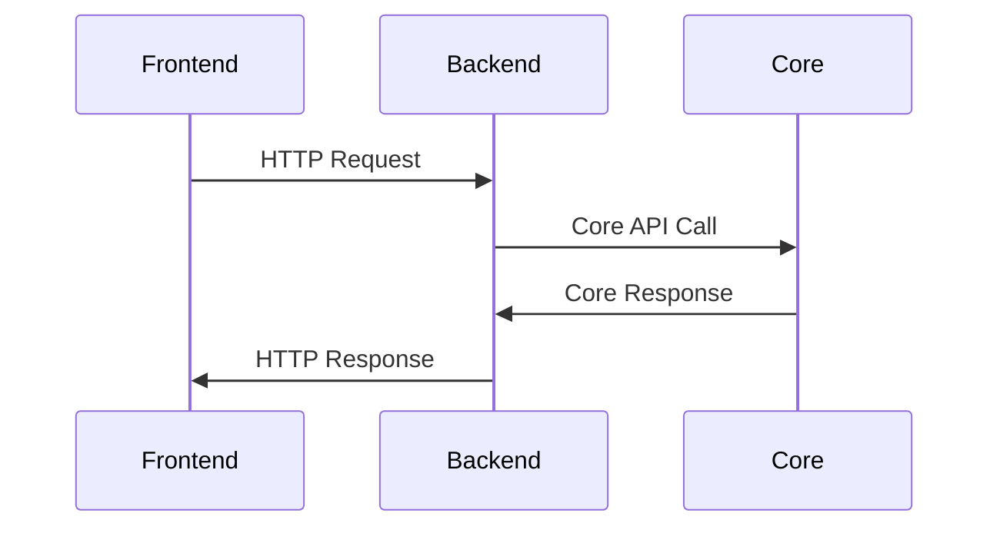
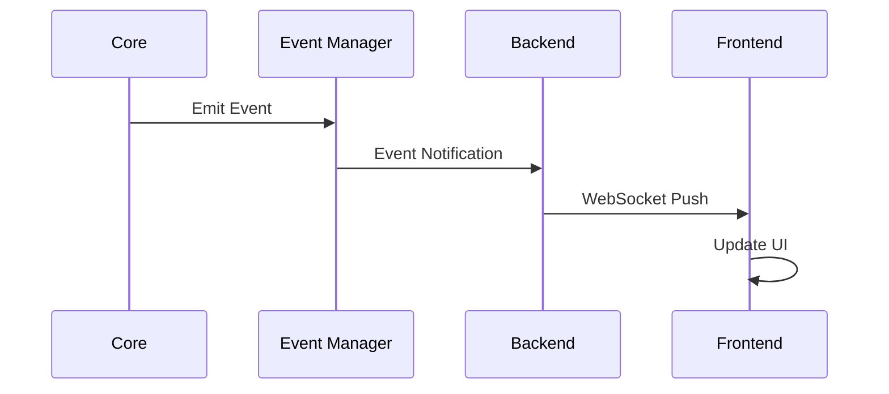
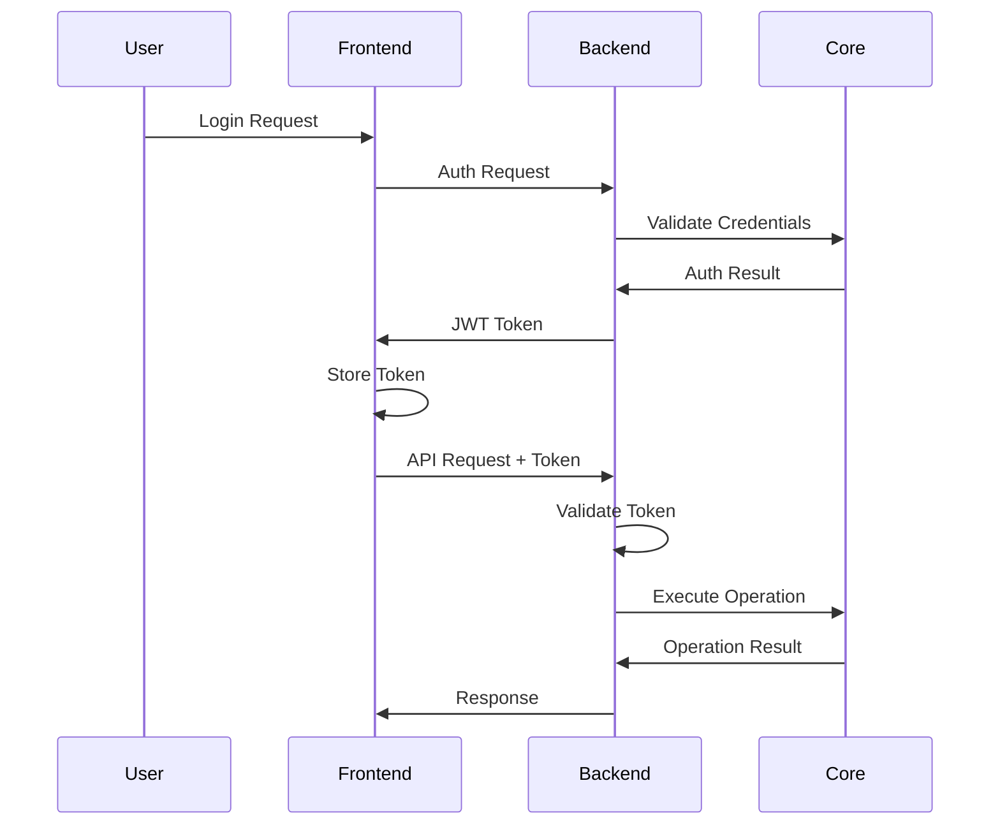

# Aetherius Component: Web 技术架构设计

## 🏛️ 架构概览

### 系统架构图
```
┌─────────────────────────────────────────────────────────────┐
│                    Aetherius Core                           │
│  ┌─────────────────┐  ┌─────────────────┐  ┌──────────────┐ │
│  │   Server API    │  │  Event Manager  │  │ Component    │ │
│  │                 │  │                 │  │ Loader       │ │
│  └─────────────────┘  └─────────────────┘  └──────────────┘ │
└─────────────────────┬───────────────────────────────────────┘
                      │ Core Integration
┌─────────────────────┴───────────────────────────────────────┐
│                Component: Web Backend                       │
│  ┌─────────────────┐  ┌─────────────────┐  ┌──────────────┐ │
│  │   FastAPI       │  │  WebSocket      │  │ Event        │ │
│  │   REST API      │  │  Manager        │  │ Listeners    │ │
│  └─────────────────┘  └─────────────────┘  └──────────────┘ │
└─────────────────────┬───────────────────────────────────────┘
                      │ HTTP/WebSocket
┌─────────────────────┴───────────────────────────────────────┐
│                  Web Frontend (Vue 3)                      │
│  ┌─────────────────┐  ┌─────────────────┐  ┌──────────────┐ │
│  │   Dashboard     │  │   Console       │  │ Player       │ │
│  │                 │  │                 │  │ Management   │ │
│  └─────────────────┘  └─────────────────┘  └──────────────┘ │
│  ┌─────────────────┐  ┌─────────────────┐  ┌──────────────┐ │
│  │ File Manager    │  │  WebSocket      │  │ State        │ │
│  │                 │  │  Client         │  │ Management   │ │
│  └─────────────────┘  └─────────────────┘  └──────────────┘ │
└─────────────────────────────────────────────────────────────┘
```

## 🔧 技术栈详细说明

### 后端技术栈
```yaml
Framework: FastAPI 0.104+
  - 高性能异步Web框架
  - 自动API文档生成
  - 内置数据验证和序列化
  
Server: Uvicorn
  - ASGI服务器
  - 支持WebSocket
  - 高并发处理能力

Communication:
  - REST API: 标准HTTP接口
  - WebSocket: 实时双向通信
  - Server-Sent Events: 单向实时推送
  
Data Format: 
  - JSON: API数据交换
  - MessagePack: WebSocket优化传输
  
Security:
  - JWT: 身份认证
  - CORS: 跨域资源共享
  - Rate Limiting: 请求频率限制
```

### 前端技术栈
```yaml
Framework: Vue 3.3+
  - Composition API
  - TypeScript支持
  - 响应式系统

Build Tool: Vite 5.0+
  - 快速热重载
  - 模块化构建
  - 代码分割优化

UI Library: Element Plus 2.4+
  - 企业级组件库
  - 主题定制支持
  - 国际化支持

State Management: Pinia 2.1+
  - 轻量级状态管理
  - TypeScript友好
  - 开发工具支持

Routing: Vue Router 4.2+
  - 声明式路由
  - 动态路由匹配
  - 路由守卫

Charts: ECharts 5.4+
  - 丰富的图表类型
  - 高性能渲染
  - 响应式图表

Code Editor: Monaco Editor
  - VS Code编辑器内核
  - 语法高亮
  - 智能提示
```

## 🔄 数据流架构

### 请求响应流程


### 实时数据流程


## 🗄️ 数据模型设计

### API数据模型
```python
# 服务器状态模型
class ServerStatus(BaseModel):
    is_running: bool
    uptime: int
    version: str
    player_count: int
    max_players: int
    tps: float
    cpu_usage: float
    memory_usage: MemoryInfo

class MemoryInfo(BaseModel):
    used: int
    max: int
    percentage: float

# 玩家信息模型
class Player(BaseModel):
    uuid: str
    name: str
    is_online: bool
    last_login: datetime
    ip_address: Optional[str]
    game_mode: str
    level: int
    experience: int

# 文件信息模型
class FileInfo(BaseModel):
    name: str
    path: str
    is_directory: bool
    size: Optional[int]
    modified_time: datetime
    permissions: str
```

### WebSocket消息模型
```python
# WebSocket消息基类
class WSMessage(BaseModel):
    type: str
    timestamp: datetime
    data: Dict[str, Any]

# 控制台消息
class ConsoleMessage(WSMessage):
    type: Literal["console"]
    data: ConsoleData

class ConsoleData(BaseModel):
    level: str  # INFO, WARN, ERROR
    message: str
    source: str

# 状态更新消息
class StatusUpdate(WSMessage):
    type: Literal["status"]
    data: ServerStatus

# 玩家事件消息
class PlayerEvent(WSMessage):
    type: Literal["player"]
    data: PlayerEventData

class PlayerEventData(BaseModel):
    event_type: str  # join, leave, chat
    player: Player
    details: Optional[Dict[str, Any]]
```

## 🌐 网络通信设计

### REST API 设计
```yaml
# 基础路径: /api/v1

# 服务器管理
GET    /server/status           # 获取服务器状态
POST   /server/start            # 启动服务器
POST   /server/stop             # 停止服务器
POST   /server/restart          # 重启服务器
POST   /server/command          # 发送控制台命令

# 玩家管理
GET    /players                 # 获取玩家列表
GET    /players/{uuid}          # 获取玩家详情
POST   /players/{uuid}/kick     # 踢出玩家
POST   /players/{uuid}/ban      # 封禁玩家
POST   /players/{uuid}/op       # 给予OP权限

# 文件管理
GET    /files                   # 获取文件列表
GET    /files/content           # 获取文件内容
POST   /files/content           # 保存文件内容
POST   /files/upload            # 上传文件
GET    /files/download          # 下载文件
DELETE /files                   # 删除文件

# 系统信息
GET    /system/info             # 获取系统信息
GET    /system/logs             # 获取系统日志
```

### WebSocket 连接设计
```python
# WebSocket端点
WS /ws/console      # 控制台实时通信
WS /ws/status       # 状态实时更新
WS /ws/events       # 事件实时推送

# 连接管理
class ConnectionManager:
    def __init__(self):
        self.active_connections: List[WebSocket] = []
        self.connection_groups: Dict[str, List[WebSocket]] = {}
    
    async def connect(self, websocket: WebSocket, group: str):
        """建立WebSocket连接"""
        
    async def disconnect(self, websocket: WebSocket, group: str):
        """断开WebSocket连接"""
        
    async def send_personal_message(self, message: str, websocket: WebSocket):
        """发送个人消息"""
        
    async def broadcast_to_group(self, message: str, group: str):
        """向组广播消息"""
```

## 🔐 安全架构设计

### 认证授权流程


### 权限控制模型
```python
# 权限级别定义
class PermissionLevel(Enum):
    VIEWER = "viewer"       # 只读权限
    OPERATOR = "operator"   # 操作权限
    ADMIN = "admin"         # 管理员权限

# 权限验证装饰器
def require_permission(level: PermissionLevel):
    def decorator(func):
        @wraps(func)
        async def wrapper(*args, **kwargs):
            # 验证用户权限
            if not has_permission(current_user, level):
                raise HttpException(403, "Insufficient permissions")
            return await func(*args, **kwargs)
        return wrapper
    return decorator

# 使用示例
@router.post("/players/{uuid}/ban")
@require_permission(PermissionLevel.ADMIN)
async def ban_player(uuid: str):
    # 封禁玩家逻辑
    pass
```

## ⚡ 性能优化策略

### 后端性能优化
```python
# 异步处理优化
import asyncio
from asyncio import gather

async def get_dashboard_data():
    """并发获取仪表盘数据"""
    tasks = [
        get_server_status(),
        get_player_list(),
        get_system_info(),
        get_recent_logs()
    ]
    results = await gather(*tasks)
    return combine_results(results)

# 缓存策略
from functools import lru_cache
import redis

redis_client = redis.Redis()

@lru_cache(maxsize=128)
async def get_cached_data(key: str, ttl: int = 60):
    """Redis缓存装饰器"""
    cached = redis_client.get(key)
    if cached:
        return json.loads(cached)
    
    data = await fetch_fresh_data(key)
    redis_client.setex(key, ttl, json.dumps(data))
    return data
```

### 前端性能优化
```typescript
// 虚拟滚动优化大列表
import { VirtualList } from '@tanstack/vue-virtual'

// 懒加载组件
const PlayerManagement = defineAsyncComponent(() => 
  import('@/views/Players/PlayerManagement.vue')
)

// WebSocket消息队列优化
class MessageQueue {
  private queue: WSMessage[] = []
  private processing = false
  
  push(message: WSMessage) {
    this.queue.push(message)
    this.process()
  }
  
  private async process() {
    if (this.processing) return
    this.processing = true
    
    while (this.queue.length > 0) {
      const batch = this.queue.splice(0, 10) // 批量处理
      await this.processBatch(batch)
      await this.nextTick() // 让出主线程
    }
    
    this.processing = false
  }
}

// 图表数据采样优化
const optimizeChartData = (data: DataPoint[], maxPoints = 100) => {
  if (data.length <= maxPoints) return data
  
  const step = Math.ceil(data.length / maxPoints)
  return data.filter((_, index) => index % step === 0)
}
```

## 🧪 测试架构设计

### 后端测试策略
```python
# 单元测试示例
import pytest
from unittest.mock import Mock, patch

@pytest.fixture
def mock_core():
    return Mock()

@pytest.mark.asyncio
async def test_get_server_status(mock_core):
    # 测试服务器状态获取
    mock_core.get_status.return_value = {
        "is_running": True,
        "player_count": 5
    }
    
    result = await get_server_status(mock_core)
    assert result.is_running is True
    assert result.player_count == 5

# API集成测试
from fastapi.testclient import TestClient

def test_server_status_endpoint():
    client = TestClient(app)
    response = client.get("/api/v1/server/status")
    assert response.status_code == 200
    assert "is_running" in response.json()
```

### 前端测试策略
```typescript
// 组件单元测试
import { mount } from '@vue/test-utils'
import { describe, it, expect } from 'vitest'
import Dashboard from '@/views/Dashboard.vue'

describe('Dashboard', () => {
  it('renders server status correctly', () => {
    const wrapper = mount(Dashboard, {
      props: {
        serverStatus: {
          isRunning: true,
          playerCount: 5
        }
      }
    })
    
    expect(wrapper.find('.server-status').text()).toContain('运行中')
    expect(wrapper.find('.player-count').text()).toContain('5')
  })
})

// E2E测试
import { test, expect } from '@playwright/test'

test('dashboard displays real-time data', async ({ page }) => {
  await page.goto('/dashboard')
  
  // 检查页面加载
  await expect(page.locator('.dashboard')).toBeVisible()
  
  // 检查实时数据更新
  const playerCount = page.locator('.player-count')
  const initialCount = await playerCount.textContent()
  
  // 模拟玩家加入
  await page.evaluate(() => {
    window.mockWebSocket.send({
      type: 'player',
      data: { event_type: 'join' }
    })
  })
  
  // 验证数据更新
  await expect(playerCount).not.toHaveText(initialCount)
})
```

## 📊 监控和日志设计

### 应用监控
```python
# 性能监控中间件
import time
from fastapi import Request

@app.middleware("http")
async def monitor_performance(request: Request, call_next):
    start_time = time.time()
    response = await call_next(request)
    process_time = time.time() - start_time
    
    # 记录性能指标
    logger.info(f"API {request.url.path} took {process_time:.3f}s")
    
    # 超时警告
    if process_time > 1.0:
        logger.warning(f"Slow API detected: {request.url.path}")
    
    return response

# WebSocket连接监控
class WebSocketMonitor:
    def __init__(self):
        self.connections = 0
        self.messages_sent = 0
        self.messages_received = 0
    
    def on_connect(self):
        self.connections += 1
        logger.info(f"WebSocket connections: {self.connections}")
    
    def on_disconnect(self):
        self.connections -= 1
        logger.info(f"WebSocket connections: {self.connections}")
```

### 错误处理和日志
```python
# 统一错误处理
from fastapi import HTTPException
from fastapi.responses import JSONResponse

@app.exception_handler(Exception)
async def global_exception_handler(request: Request, exc: Exception):
    logger.error(f"Unhandled exception: {exc}", exc_info=True)
    
    return JSONResponse(
        status_code=500,
        content={
            "error": "Internal server error",
            "message": "An unexpected error occurred",
            "request_id": generate_request_id()
        }
    )

# 结构化日志配置
import structlog

logger = structlog.get_logger()

# 使用示例
logger.info("Player action executed", 
           player_uuid=player.uuid,
           action="ban",
           admin_user=current_user.name,
           duration=3600)
```